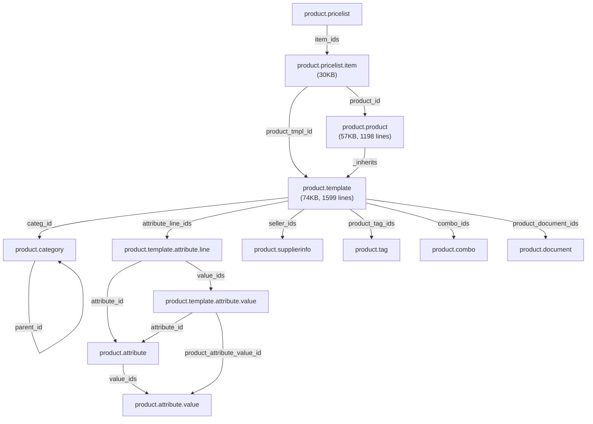

# Analysis: Odoo `product` Module

> Core module for managing Products & Pricelists in Odoo. This is the base model that Studio CE targets with `product.template`.

---

## Module Identity

| Property | Value |
|---|---|
| **Name** | Products & Pricelists |
| **Version** | 1.2 |
| **Category** | Sales/Sales |
| **Dependencies** | `base`, `mail`, `uom` |
| **License** | LGPL-3 |
| **Author** | Odoo S.A. |

---

## Architecture Overview

```
product/
├── controllers/         # 3 controllers (catalog, pricelist report, document)
├── data/                # Seed data + demo data (6 files)
├── models/              # 26 model files (~260KB total)
├── report/              # 8 files (labels, pricelists, packaging)
├── security/            # Groups, ACLs, record rules (multi-company)
├── static/src/          # JS, SCSS, XML frontend assets
├── tests/               # 15 test files (~200KB)
├── views/               # 16 XML view files
└── wizard/              # 2 wizards (label layout, attribute value update)
```

---

## Core Data Models

### Primary Models (Product hierarchy)

| Model | File | Size | Description |
|---|---|---|---|
| [product.template](file:///X:/Repositories/addons/product/models/product_template.py) | `product_template.py` | 74KB / 1,599 lines | **The main product model.** Defines the product "blueprint" — name, type, price, UoM, category, attributes, variants, seller info. Inherits `mail.thread`, `mail.activity.mixin`, `image.mixin`. |
| [product.product](file:///X:/Repositories/addons/product/models/product_product.py) | `product_product.py` | 57KB / 1,198 lines | **Product variant.** Uses `_inherits` from `product.template` (delegation inheritance). Each variant has its own barcode, internal reference, cost, weight, volume. |
| [product.category](file:///X:/Repositories/addons/product/models/product_category.py) | `product_category.py` | 2.8KB | Hierarchical product categories (`_parent_store`). Supports nested tree structure with `complete_name` computation. |

### Attribute & Variant System

| Model | File | Description |
|---|---|---|
| [product.attribute](file:///X:/Repositories/addons/product/models/product_attribute.py) | `product_attribute.py` | Attribute definitions (e.g., Color, Size). Supports 6 display types: radio, pills, select, color, multi-checkbox, image. 3 variant creation modes: instantly, dynamically, never. |
| [product.attribute.value](file:///X:/Repositories/addons/product/models/product_attribute_value.py) | `product_attribute_value.py` | Attribute value definitions (e.g., Red, Blue, Large, Small). |
| [product.template.attribute.line](file:///X:/Repositories/addons/product/models/product_template_attribute_line.py) | `product_template_attribute_line.py` | Links attributes to specific product templates. Controls which attribute values are available per product. |
| [product.template.attribute.value](file:///X:/Repositories/addons/product/models/product_template_attribute_value.py) | `product_template_attribute_value.py` | Per-template attribute value configuration (price extras, exclusions). |
| [product.template.attribute.exclusion](file:///X:/Repositories/addons/product/models/product_template_attribute_exclusion.py) | `product_template_attribute_exclusion.py` | Defines which attribute value combinations are excluded/incompatible. |

### Pricing System

| Model | File | Size | Description |
|---|---|---|---|
| [product.pricelist](file:///X:/Repositories/addons/product/models/product_pricelist.py) | `product_pricelist.py` | 17KB | Pricelist definitions. Multi-company, multi-currency. Supports country group restrictions. |
| [product.pricelist.item](file:///X:/Repositories/addons/product/models/product_pricelist_item.py) | `product_pricelist_item.py` | **30KB** | Pricelist rules — the most complex pricing model. Supports discount by product/category/qty, computed prices from other pricelists, cost, or list price. |

### Supporting Models

| Model | File | Description |
|---|---|---|
| [product.supplierinfo](file:///X:/Repositories/addons/product/models/product_supplierinfo.py) | `product_supplierinfo.py` | Vendor pricing information per product. |
| [product.tag](file:///X:/Repositories/addons/product/models/product_tag.py) | `product_tag.py` | Product tags with color support. |
| [product.combo](file:///X:/Repositories/addons/product/models/product_combo.py) | `product_combo.py` | Combo product groupings. |
| [product.combo.item](file:///X:/Repositories/addons/product/models/product_combo_item.py) | `product_combo_item.py` | Individual items within a combo. |
| [product.document](file:///X:/Repositories/addons/product/models/product_document.py) | `product_document.py` | Product documentation attachments. |
| [product.catalog.mixin](file:///X:/Repositories/addons/product/models/product_catalog_mixin.py) | `product_catalog_mixin.py` | Mixin for catalog integration (used by other modules like sale, purchase). |
| [product.uom](file:///X:/Repositories/addons/product/models/product_uom.py) | `product_uom.py` | Product-specific UoM barcode mappings. |

### Extended Core Models

| Model | File | Description |
|---|---|---|
| [res.company](file:///X:/Repositories/addons/product/models/res_company.py) | `res_company.py` | Adds product-related company settings. |
| [res.config.settings](file:///X:/Repositories/addons/product/models/res_config_settings.py) | `res_config_settings.py` | Product configuration settings. |
| [res.partner](file:///X:/Repositories/addons/product/models/res_partner.py) | `res_partner.py` | Adds product-related partner fields. |
| [res.currency](file:///X:/Repositories/addons/product/models/res_currency.py) | `res_currency.py` | Currency rounding for products. |
| [res.country.group](file:///X:/Repositories/addons/product/models/res_country_group.py) | `res_country_group.py` | Country group pricelist relation. |
| [ir.attachment](file:///X:/Repositories/addons/product/models/ir_attachment.py) | `ir_attachment.py` | Attachment handling for product documents. |
| [uom.uom](file:///X:/Repositories/addons/product/models/uom_uom.py) | `uom_uom.py` | UoM extensions. |

---

## Key `product.template` Fields

> [!IMPORTANT]
> This is the model your Studio CE editor targets by default. Here are the key fields:

| Field | Type | Description |
|---|---|---|
| `name` | Char | Product name (translatable, trigram indexed) |
| `type` | Selection | `consu` (Goods), `service` (Service), `combo` (Combo) |
| `list_price` | Float | Sales price (default 1.0, tracked) |
| `standard_price` | Float | Cost (company-dependent, computed) |
| `categ_id` | Many2one → `product.category` | Product category |
| `uom_id` | Many2one → `uom.uom` | Default unit of measure |
| `sale_ok` | Boolean | Can be sold (default True) |
| `purchase_ok` | Boolean | Can be purchased (default True) |
| `active` | Boolean | Archive toggle |
| `barcode` | Char | EAN/barcode (computed from variant) |
| `default_code` | Char | Internal reference (computed from variant) |
| `attribute_line_ids` | One2many → `product.template.attribute.line` | Product attributes |
| `product_variant_ids` | One2many → `product.product` | Variants |
| `seller_ids` | One2many → `product supplierinfo` | Vendor info |
| `pricelist_rule_ids` | One2many → `product.pricelist.item` | Pricelist rules |
| `product_tag_ids` | Many2many → `product.tag` | Tags |
| `product_properties` | Properties | Dynamic properties (defined by category) |
| `combo_ids` | Many2many → `product.combo` | Combo choices |
| `is_favorite` | Boolean | Favorite toggle |
| `weight` / `volume` | Float | Physical dimensions |

---

## Security Model

### Groups

| XML ID | Name | Purpose |
|---|---|---|
| `product.group_product_pricelist` | Basic Pricelists | Enables pricelist features |
| `product.group_product_variant` | Manage Product Variants | Enables variant management |
| `product.group_product_manager` | Create (Products) | Full product management (implied by `base.group_system`) |

### Record Rules (Multi-Company)

All rules follow the pattern: `['|', ('company_id', 'parent_of', company_ids), ('company_id', '=', False)]`

| Rule | Model |
|---|---|
| `product_comp_rule` | `product.template` |
| `product_document_comp_rule` | `product.document` |
| `product_pricelist_comp_rule` | `product.pricelist` |
| `product_pricelist_item_comp_rule` | `product.pricelist.item` |
| `product_supplierinfo_comp_rule` | `product.supplierinfo` |
| `product_combo_comp_rule` | `product.combo` |

---

## Views (16 files)

| View File | Size | Purpose |
|---|---|---|
| [product_views.xml](file:///X:/Repositories/addons/product/views/product_views.xml) | **44KB** | Main product form/list/search/kanban views |
| [product_pricelist_item_views.xml](file:///X:/Repositories/addons/product/views/product_pricelist_item_views.xml) | 15KB | Pricelist item CRUD views |
| [product_template_views.xml](file:///X:/Repositories/addons/product/views/product_template_views.xml) | 11KB | Template-specific views |
| [product_attribute_views.xml](file:///X:/Repositories/addons/product/views/product_attribute_views.xml) | 9.7KB | Attribute management views |
| [product_supplierinfo_views.xml](file:///X:/Repositories/addons/product/views/product_supplierinfo_views.xml) | 7.2KB | Vendor pricing views |
| [product_document_views.xml](file:///X:/Repositories/addons/product/views/product_document_views.xml) | 6.7KB | Document management views |
| [product_pricelist_views.xml](file:///X:/Repositories/addons/product/views/product_pricelist_views.xml) | 5.9KB | Pricelist management views |
| Others (9 files) | ~12KB | Category, combo, tag, partner, settings, UoM |

---

## Reports

| Report | Description |
|---|---|
| Product labels | Barcode label printing (multiple formats) |
| Product internal | Internal product details report |
| Pricelist report | Formatted pricelist pricing report |
| Packaging report | Product packaging details |

---

## Test Suite (15 files, ~200KB)

| Test File | Size | Coverage |
|---|---|---|
| `test_variants.py` | **77KB** | Variant creation, attribute combinations, exclusions |
| `test_product_attribute_value_config.py` | 41KB | Attribute value configuration |
| `test_pricelist.py` | 21KB | Pricelist pricing computation |
| `test_product_pricelist.py` | 16KB | Pricelist rules |
| `test_import_files.py` | 9.2KB | CSV/Excel product import |
| `test_barcode.py` | 6.9KB | Barcode handling |
| `test_seller.py` | 6.9KB | Vendor info |
| Others (8 files) | ~25KB | Combos, rounding, naming, common fixtures |

---

## Relevance to Studio CE

> [!TIP]
> When Studio CE opens with `product.template` as the default model, here's what the user will see:

- **Fields tab**: ~40+ fields including complex computed fields, relational fields (Many2one, One2many, Many2many), and the Properties field
- **Views tab**: Form, tree, and search views from `product_views.xml` and `product_template_views.xml`
- **Rules tab**: Any `base.automation` rules on `product.template`

### Considerations for Studio CE

1. **Complex inheritance**: `product.product` uses `_inherits` (delegation) from `product.template` — fields added to `product.template` automatically appear on `product.product`
2. **Computed fields**: Many fields are computed (`standard_price`, `barcode`, `default_code`) — Studio CE custom fields won't conflict with these
3. **Multi-company rules**: Custom fields added by Studio CE will be subject to existing multi-company record rules
4. **Large view files**: `product_views.xml` is 44KB — XPath modifications via Studio CE will create inherited views on top of these

---

## Model Relationship Diagram


